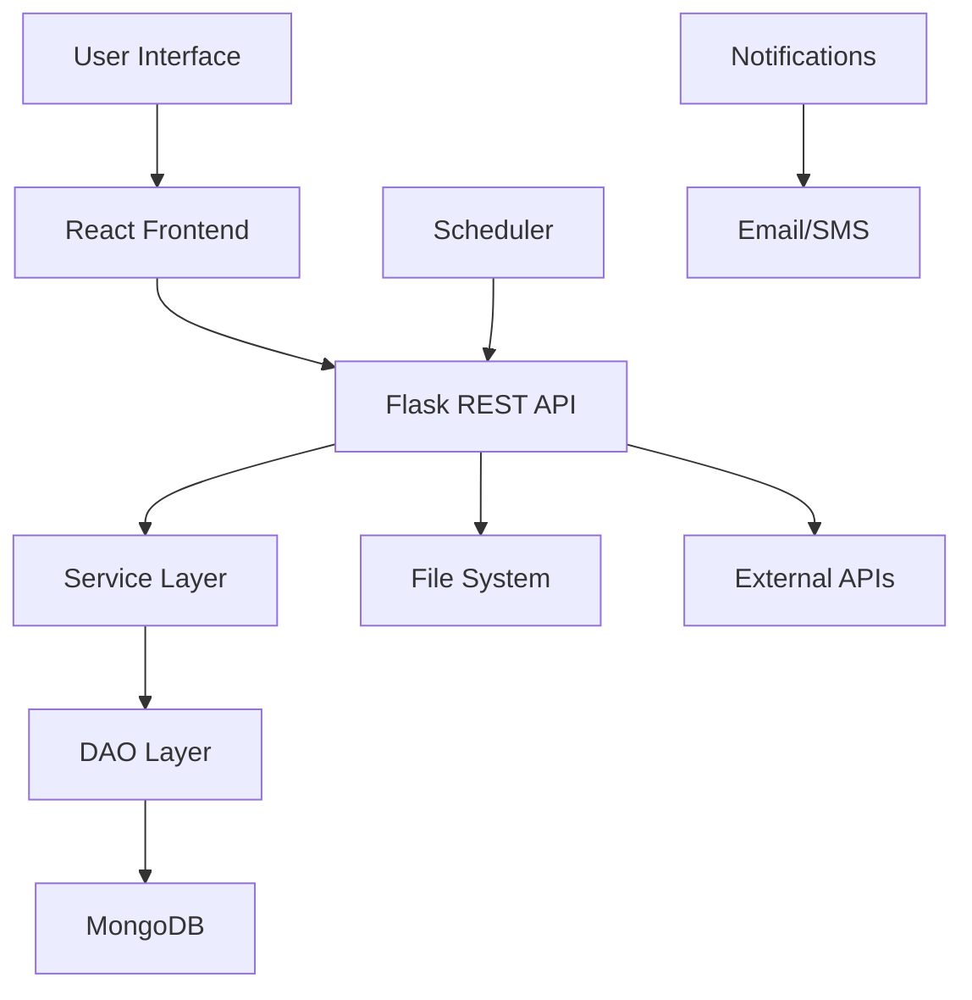

# AKDOT Transportation Management System

A comprehensive web-based transportation management system developed for the Alaska Department of Transportation (AKDOT) to monitor, analyze, and manage port operations, traffic incidents, and scenario planning.

## 🎯 Project Overview

This system provides real-time monitoring, predictive analytics, and decision support tools for transportation infrastructure management in Alaska. It combines data visualization, incident management, scenario analysis, and risk assessment capabilities into a unified platform.

## 🏗️ Architecture

### System Architecture Overview

The AKDOT Transportation Management System follows a **microservices architecture** with a **three-tier design** pattern, ensuring scalability, maintainability, and high availability.

#### 🏛️ Architecture Pattern: Three-Tier Design
```
┌─────────────────────────────────────────────────────────────────┐
│                        Presentation Layer                        │
│  ┌─────────────────┐  ┌─────────────────┐  ┌─────────────────┐  │
│  │   React UI      │  │   Mobile App    │  │   Admin Portal  │  │
│  │   (Frontend)    │  │   (Future)      │  │   (Future)      │  │
│  └─────────────────┘  └─────────────────┘  └─────────────────┘  │
└─────────────────────────────────────────────────────────────────┘
                                │
                                ▼
┌─────────────────────────────────────────────────────────────────┐
│                        Application Layer                         │
│  ┌─────────────────────────────────────────────────────────┐   │
│  │                  Flask REST API Server                   │   │
│  │  ┌─────────────┐  ┌─────────────┐  ┌─────────────┐      │   │
│  │  │   Services  │  │   Controllers│  │   Middleware │      │   │
│  │  │   Layer     │  │   Layer      │  │   Layer      │      │   │
│  │  └─────────────┘  └─────────────┘  └─────────────┘      │   │
│  └─────────────────────────────────────────────────────────┘   │
└─────────────────────────────────────────────────────────────────┘
                                │
                                ▼
┌─────────────────────────────────────────────────────────────────┐
│                         Data Layer                               │
│  ┌─────────────────┐  ┌─────────────────┐  ┌─────────────────┐  │
│  │   MongoDB       │  │   File System   │  │   External APIs │  │
│  │   (Database)    │  │   (Static Files)│  │   (Integrations)│  │
│  └─────────────────┘  └─────────────────┘  └─────────────────┘  │
└─────────────────────────────────────────────────────────────────┘
```

### 🛠️ Technology Stack

#### **Backend Architecture**
- **Framework**: Flask (Python 3.8+) with Blueprint pattern
- **API Design**: RESTful architecture with JSON responses
- **Authentication**: JWT tokens with bcrypt password hashing
- **Session Management**: UUID-based session tokens
- **CORS**: Configured for cross-origin requests
- **Background Jobs**: APScheduler for scheduled tasks

#### **Frontend Architecture**
- **Framework**: React 18+ with functional components and hooks
- **State Management**: React Context API and local state
- **UI Framework**: Material-UI (MUI) for consistent design
- **Routing**: React Router for SPA navigation
- **HTTP Client**: Axios for API communication
- **Build Tool**: Create React App with Webpack

#### **Database & Storage**
- **Primary Database**: MongoDB with document-based storage
- **File Storage**: Local filesystem for static files and uploads
- **Caching**: In-memory caching for frequently accessed data
- **Data Formats**: JSON for API communication, Excel for imports/exports

#### **Infrastructure & DevOps**
- **Containerization**: Docker containers for consistent deployment
- **Orchestration**: Docker Compose for multi-container management
- **Environment Management**: Environment variables for configuration
- **Monitoring**: Built-in logging and error handling
- **CI/CD Ready**: GitHub Actions compatible structure

### 🔧 Microservices Design

#### **Core Services**
```
┌─────────────────────────────────────────────────────────────┐
│                    Service Architecture                     │
├─────────────────────────────────────────────────────────────┤
│  📊 Dashboard Service                                       │
│     - Real-time data aggregation                            │
│     - JSON generation for charts                            │
│     - Scheduled data refresh                                │
│                                                             │
│  🚨 Incident Service                                        │
│     - CRUD operations for incidents                         │
│     - Priority-based notifications                          │
│     - Historical data analysis                              │
│                                                             │
│  📈 Scenario Analysis Service                               │
│     - Short-term disruption modeling                        │
│     - Long-term planning scenarios                          │
│     - Route optimization algorithms                         │
│                                                             │
│  ⚠️ Risk Analysis Service                                   │
│     - Section-based risk assessment                         │
│     - Route risk evaluation                                 │
│     - Predictive modeling                                   │
│                                                             │
│  📧 Notification Service                                    │
│     - Email notifications via SMTP                          │
│     - SMS notifications via Twilio                          │
│     - Subscription management                               │
└─────────────────────────────────────────────────────────────┘
```

### 🔄 Data Flow Architecture



### 🏗️ Component Architecture

#### **Backend Components**
```
flask-server/
├── app.py                    # Main application entry point
├── config.py                 # Configuration management
├── dao/                      # Data Access Objects
│   ├── incident_dao.py       # Incident data operations
│   └── user_dao.py           # User management
├── services/                 # Business logic layer
│   ├── dashboard_service.py  # Dashboard data generation
│   ├── incident_service.py   # Incident management
│   └── scenario_analysis.py  # Scenario processing
├── scenarioanalysis/         # Analysis modules
├── dashboard/               # Dashboard components
├── risk/                    # Risk analysis modules
└── subscribe/               # Notification services
```

#### **Frontend Components**
```
react-ui/
├── src/
│   ├── components/          # Reusable UI components
│   ├── pages/              # Application pages
│   ├── services/           # API service layer
│   └── utils/              # Utility functions
├── public/                 # Static assets
└── package.json            # Dependencies and scripts
```

### 🔐 Security Architecture

- **Authentication**: JWT tokens with refresh mechanism
- **Authorization**: Role-based access control (RBAC)
- **Data Encryption**: HTTPS/TLS for data in transit
- **Input Validation**: Comprehensive sanitization and validation
- **Rate Limiting**: API endpoint protection
- **Error Handling**: Secure error messages without sensitive data

### 📊 Scalability Design

- **Horizontal Scaling**: Microservices can be deployed independently
- **Load Balancing**: Ready for load balancer integration
- **Database Sharding**: MongoDB supports horizontal scaling
- **Caching Strategy**: Multi-level caching for performance
- **CDN Ready**: Static assets can be served via CDN

### 🚀 Deployment Architecture

#### **Development Environment**
```bash
# Local development
docker-compose up --build

# Individual services
cd flask-server && python app.py
cd react-ui && npm start
```

#### **Production Environment**
```bash
# Production build
docker-compose -f docker-compose.prod.yml up -d

# Environment variables
export BASE_PATH=/opt/akdot
export NODE_ENV=production
export FLASK_ENV=production
```

## 🚀 Features

### 1. Real-time Dashboard
- **Live traffic monitoring** with hourly/daily/weekly analytics
- **Queue length tracking** and bottleneck identification
- **Cycle time analysis** for different vehicle types
- **Waiting time predictions** using historical data

### 2. Incident Management
- **Incident reporting** with geolocation and priority levels
- **Real-time incident tracking** and status updates
- **Automated notifications** to stakeholders
- **Historical incident analysis** and reporting

### 3. Scenario Analysis
- **Short-term disruption modeling** (hours to days)
- **Long-term planning scenarios** (weeks to months)
- **Route optimization** under different conditions
- **Impact assessment** for construction/maintenance

### 4. Risk Analysis
- **Section-based risk assessment**
- **Route risk evaluation**
- **Predictive risk modeling**
- **Risk mitigation recommendations**

### 5. Subscription Services
- **Email notifications** for incidents and updates
- **SMS alerts** for critical situations
- **Customizable subscription preferences**
- **Multi-channel communication** support

## 📊 Data Analytics

### Supported Vehicle Types
- **Cars**: Passenger vehicles and light trucks
- **Trucks**: Commercial and heavy-duty vehicles
- **Combined Analysis**: Integrated traffic flow modeling

### Key Metrics
- Hourly traffic counts
- Average cycle times
- Maximum queue lengths
- Section-based traffic distribution
- Correlation analysis between different metrics

## 🔧 API Endpoints

### Authentication
- `POST /login` - User authentication
- `POST /register` - New user registration
- `POST /logout` - Session termination

### Incident Management
- `GET /incidents` - Retrieve all open incidents
- `POST /incidents` - Create new incident
- `PUT /incidents/<id>` - Update incident details
- `PUT /closeincident/<id>` - Close incident

### Scenario Analysis
- `POST /scenario_analysis` - Run scenario analysis
- `GET /scenario_analysis/plots_suggestions` - Get visualization data
- `POST /upload_csv` - Upload custom data for analysis

### Dashboard
- `GET /dashboard/cycle_times` - Get cycle time data
- `GET /dashboard/hourly_counts` - Get hourly traffic counts
- `GET /dashboard/max_queue_length` - Get queue length data

### Risk Analysis
- `GET /riskSection` - Get risk data for specific section
- `GET /riskRoute` - Get risk data for specific route

## 🐳 Docker Setup

### Prerequisites
- Docker and Docker Compose installed
- Environment variables configured (see `.env` setup)

### Quick Start

1. **Clone the repository**
   ```bash
   git clone [repository-url]
   cd akdot
   ```

2. **Set up environment variables**
   ```bash
   # Create .env file with required variables
   BASE_PATH=/path/to/project
   MONGODB_URI=mongodb://localhost:27017/akdot
   EMAIL_PASSWORD=your-email-password
   ```

3. **Start the services**
   ```bash
   docker-compose up --build
   ```

4. **Access the application**
   - Frontend: http://localhost:3000
   - Backend API: http://localhost:7001

## 🔧 Development Setup

### Backend Development

1. **Navigate to flask-server directory**
   ```bash
   cd flask-server
   ```

2. **Install dependencies**
   ```bash
   pip install -r requirements.txt
   ```

3. **Set environment variables**
   ```bash
   export BASE_PATH=/absolute/path/to/project
   export FLASK_ENV=development
   ```

4. **Run the development server**
   ```bash
   python app.py
   ```

### Frontend Development

1. **Navigate to react-ui directory**
   ```bash
   cd react-ui
   ```

2. **Install dependencies**
   ```bash
   npm install
   ```

3. **Start the development server**
   ```bash
   npm start
   ```

## 📁 Project Structure

```
akdot/
├── flask-server/
│   ├── app.py                 # Main Flask application
│   ├── config.py              # Configuration settings
│   ├── requirements.txt       # Python dependencies
│   ├── Dockerfile            # Backend container configuration
│   ├── dao/                  # Data access objects
│   ├── services/             # Business logic services
│   ├── scenarioanalysis/     # Scenario analysis modules
│   ├── dashboard/            # Dashboard data generation
│   ├── risk/                 # Risk analysis modules
│   └── subscribe/            # Notification services
├── react-ui/
│   ├── src/
│   │   ├── components/       # React components
│   │   ├── pages/           # Application pages
│   │   └── data/            # Static data files
│   ├── Dockerfile           # Frontend container configuration
│   └── package.json         # Node.js dependencies
├── docker-compose.yml       # Container orchestration
└── README.md               # Project documentation
```

## 🧪 Testing

### Backend Testing
```bash
cd flask-server
python -m pytest tests/
```

### Frontend Testing
```bash
cd react-ui
npm test
```

## 📈 Performance Optimization

### Background Jobs
- **Dashboard JSON generation**: Runs daily at 12:30 AM
- **Data aggregation**: Scheduled based on traffic patterns
- **Notification processing**: Real-time with queue management

### Caching Strategy
- **Static data**: Cached for 1 hour
- **Dynamic calculations**: Cached for 15 minutes
- **User sessions**: Cached for 24 hours

## 🔐 Security Features

- **Password hashing** using bcrypt
- **Session management** with UUID tokens
- **CORS configuration** for cross-origin requests
- **Input validation** and sanitization
- **Rate limiting** on API endpoints


## 🤝 Contributing

1. Fork the repository
2. Create a feature branch (`git checkout -b feature/amazing-feature`)
3. Commit your changes (`git commit -m 'Add amazing feature'`)
4. Push to the branch (`git push origin feature/amazing-feature`)
5. Open a Pull Request

## 📄 License

This project is proprietary software developed for the Alaska Department of Transportation. All rights reserved.

## 🙏 Acknowledgments

- Alaska Department of Transportation for project sponsorship
- Development team for continuous improvements
- Stakeholders for valuable feedback and requirements
